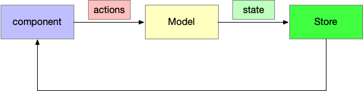

# flow 核心概念

## 1. 数据驱动

react 是由数据驱动的前端框架，flow 的核心就是帮助把散落的数据集中在`store`内统一管理。

## 2. store/仓库

store 可以把它当作一个大的容器，接收各个`model`内的数据，把它们集中起来。组件通过一定的方式，拿到这些数据，从而根据这些数据对页面进行不同的渲染。

## 3. model/模型

model 是链接`component`和`store`的桥梁，它提供`actions`供`component`调用来更新`state`，所有 model 的 state 集合作为 store。

## 4. state/状态

描述了当前模型的状态和数据，例如是否登陆、显示的数据列表，都可以储存在这里。

## 4. actions/动作

actions 顾名思义，是一个`动作`。当组件内触发某个动作的时候，可以以`同步`或`异步`的方式，更新数据，从而更新页面的内容。

### 4.1 reducer

reducer 是`同步的actions`，一个 reducer 就是一个普通的函数，它可以接收一些数据，做一些同步的处理，然后返回一个新的数据。

### 4.2 effect

effect 是`异步的actions`，一个 effect **_必须_**是一个`async/await`类型的函数，它可以接收一些数据，做一些异步处理（如：和服务器通信），然后通过调用 reducer 来更新数据。

## 5. component/组件

flow 中，把组件分为两类：与`model`直接联系的，叫做`Container`（容器组件）；不与`model`直接联系的，叫做`component`（展示组件）。这两种组件除了能否与 model 直接联系这一个区别外，可以是`有状态组件`或`无状态组件`。

### 5.1 component

展示组件不与`model`，它如果想通过 action 更新 store，就必须作为容器组件的子组件，通过 props 传入 actions。

### 5.2 container

容器组件通过`model`控制着整个项目的数据。在 flow 中，即便不同的容器组件，也可以拿到所有 store 内的数据。意味着当容器组件调用混乱的时候，可能会污染全局的数据。这里需要当心，最好规范化容器组件和 model 的职能。

## 6. flow 流程图示

